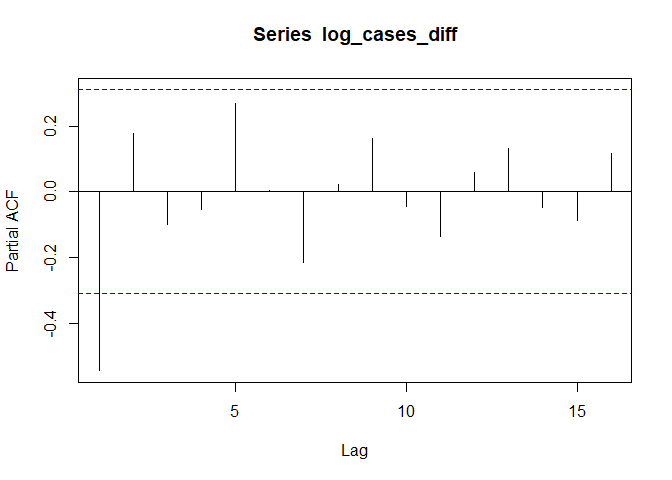

Covid Analysis
================

## Introduction

<TO BE FILLED OUT BY VIOLET>

## Analysis

We use Box Jenkins forecasting to forecast the number of new COVID-19
cases per day in the United States. Below, we will take the following 5
steps of Box Jenkins model fitting.

1.  Reducing the observed series to stationary
2.  Selecting an appropriate ARMA model for the time series
3.  Estimating the parameters of the model
4.  Performing diagnostic measures on the fitted models to assess the
    goodness-of-fit
5.  If necessary, examining alternative models for the data

Then, we predict the number of new COVID-19 cases in the United States
for the next 5 days assuming no drastic events occur in the spreading of
the disease.

### Exploratory Analysis

We first plotted our time series and its ACF. It was immediately clear
that there was a multiplicative trend due to the series’ exponential
nature, so we decided to work with the log of the series for the rest of
this report.

``` r
data = read.csv('us_covid_data.csv')
cases = as.ts(rev(data$cases))
cases = as.ts(cases[59:length(cases)])

plot(cases)
```

<!-- -->

``` r
acf(cases)
```

<!-- -->

``` r
log_cases = log(cases)

plot(log_cases)
```

<!-- -->

``` r
acf(log_cases)
```

<!-- -->

The log of our original series was still non-stationary due to its
upward trend. We chose to apply a differencing operator to remove the
trend and make the series stationary for further model fitting.

``` r
log_cases_diff = diff(log_cases)
plot(log_cases_diff)
```

<!-- -->

``` r
acf(log_cases_diff)
```

<!-- -->

``` r
pacf(log_cases_diff)
```

<!-- -->

### Model Selection and Fitting

Based on the ACF and PACF of our original time series and its
differenced version, we decided to evaluate the models ARIMA(1,1,0) and
ARIMA(0,1,3). We chose to difference the time series to remove the trend
as the original (log) time series appeared non-stationary. We then chose
to evaluate fitting ARMA(1,0) and ARMA(0,3) on the differenced series
since the ACF of the differenced series cuts off at 3 and the PACF of
the differenced series cuts off at 1 respectively.

We use the CSS-ML method for model fitting.

``` r
arima110 = arima(log_cases, order=c(1,1,0))
arima013 = arima(log_cases, order=c(0,1,3))
```

### Diagnostics

We now run some diagnostics on our models to assess whether they are
good or bad fit to our time series data.

#### 1\. Ljung-Box Test

``` r
tsdiag(arima110)
```

<!-- -->

``` r
tsdiag(arima013)
```

<!-- --> The
standardized residuals and the ACF of residuals for both ARIMA(1,1,0)
and ARIMA(0,1,3) models are generally low and do not display explicit
patterns. This suggests that our models are not bad fit for our data at
the first glance.

Ljung-Box test assesses whether the ACF of fitted residuals are
independent or not. Since the null hypothesis is the statement that the
residuals are independent, models with low p-values are not good fit. In
our cases, both ARIMA(1,1,0) and ARIMA(0,1,3) models have p-values
greater than 0.1 across different lags, and therefore the test suggests
that the models are good fit for our data.

#### 2\. Model Assessment Through Train-Test Scheme

We decided to fit our ARIMA models on subsets of our series and evalute
how good the models are in predicting the remaining entries. Our
evaluation metric is Mean Squared Error since Box-Jenkins forecasting is
optimal with respect to MSE.

``` r
train_data = log_cases[1:34]
test_data = log_cases[35:length((log_cases))]

arima110_train = arima(train_data, order=c(1,1,0))
arima110_pred = predict(arima110_train, c(7))
arima110_mse = sum((test_data - arima110_pred$pred)^2)

arima013_train = arima(train_data, order=c(0,1,3))
arima013_pred = predict(arima013_train, c(7))
arima013_mse = sum((test_data - arima013_pred$pred)^2)
```

Mean Squared Error

| Train/Test Set Sizes | ARIMA(1,1,0) MSE | ARIMA01,1,3) MSE |
| -------------------- | :--------------: | :--------------: |
| 34 / 7               |      0.8918      |      0.7724      |
| 36 / 5               |      0.1378      |      0.0500      |
| 38 / 3               |      0.0576      |      0.0465      |

We find that MSE for both models are relatively low. We decided to use
ARIMA(0,1,3) as our final model since it had lower MSE across different
configurations of training and test set sizes.

### Predicting Future Daily COVID-19 Cases

Using our ARIMA(0,1,3) model, we now predict the progression of COVID-19
for the next 5 days - from April 8th to April 18th - with 95% confidence
interval.

``` r
Pred5 = forecast(arima013, h=5)
LowerBound = exp(Pred5$lower[6:10])
Mean = exp(Pred5$mean)
UpperBound = exp(Pred5$upper[6:10])
Days = seq(1,5)
matplot(Days, cbind(LowerBound, Mean, UpperBound), type='l', lty=c(2,1,2), col=c('red', 'black', 'red'), xlab='Day', ylab='New Cases Per Day')
```

<!-- -->

The black line denotes the expected number of new cases that will arise
and the red line denotes the 95% confidence interval of the prediction.
The fitted model shows us that the number of cases to follow will at
least be tens of thousands, and in worst case, hundreds of thousands.
Our analysis highlights a clear need for the US government to take a
drastic measure to curtail the future infections. Otherwise, the number
of new infections will continue to increase at a very sharp rate.

## Conclusion

<TO BE FILLED OUT BY LEO>
